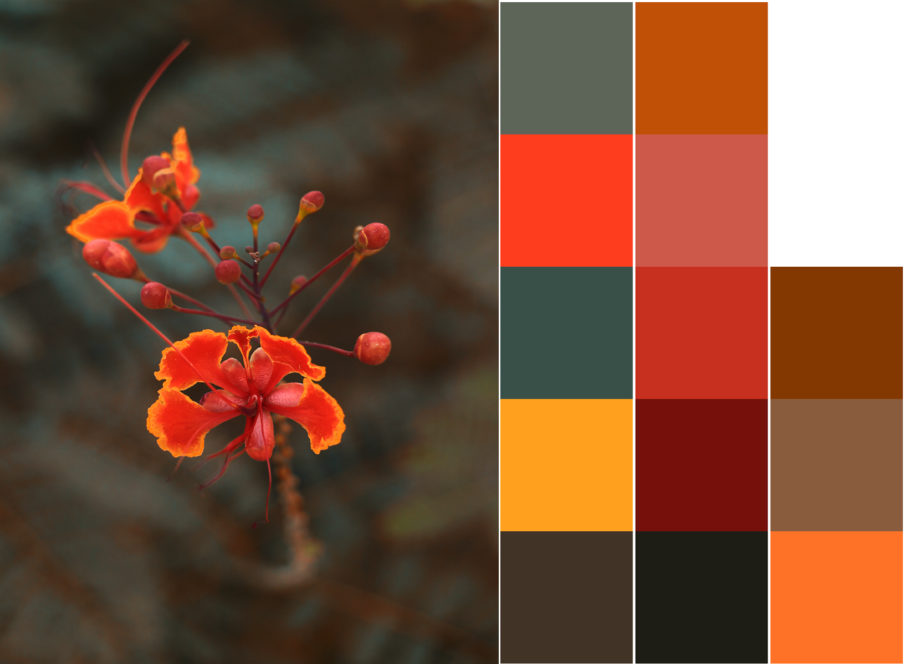
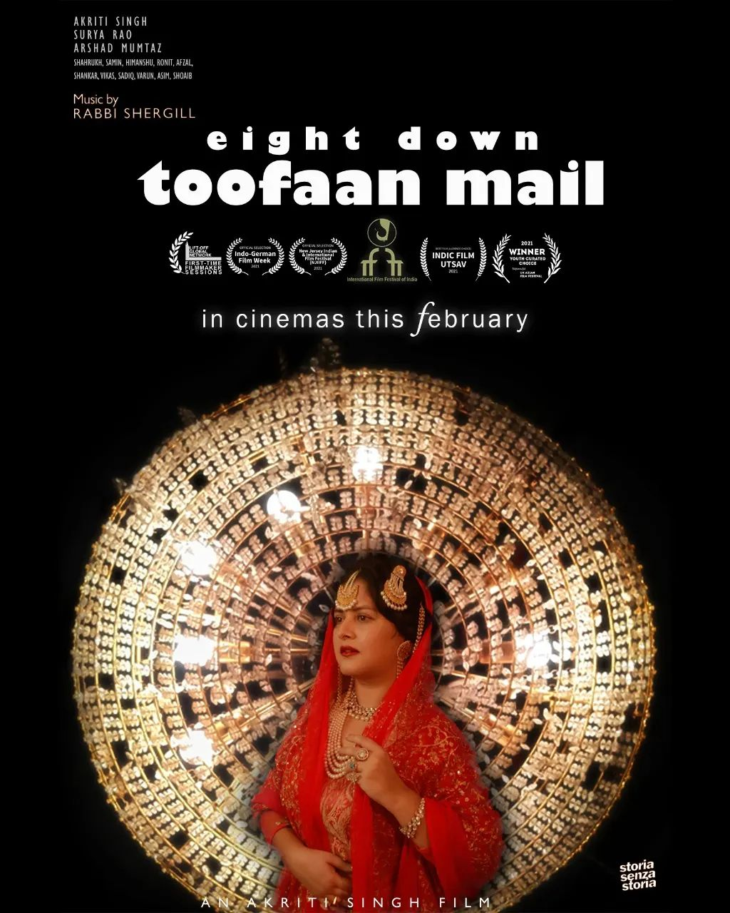

# Kandinsky  
**Clustering and Quantization**  
**Using photographs as visual input**  

<html> 
	  
</html>    
    
Significant colors in a photograph.  

---
  
# Notebooks  
  
### 01 This Whole Colour Thing  
  
---  
  
# Eight Down Toofaan Mail  
Kandinsky helped in the cinematography for our feature film **Eight Down Toofaan Mail**.  
  
<html> 
	
	   
</html>    
  
After a successful awards run and theatrical distribution in India, the film is now [on YouTube](https://www.youtube.com/watch?v=VnHPtozfhRU)      
    
# References  
- [Useful Color Equations](http://www.brucelindbloom.com/index.html?SpectCalcSpreadsheets.html)  
- [Colour-Science](https://www.colour-science.org/) and [GitHub](https://github.com/colour-science/colour)  
- [Awesome Color from Colour-Science](https://github.com/colour-science/awesome-colour)  
  